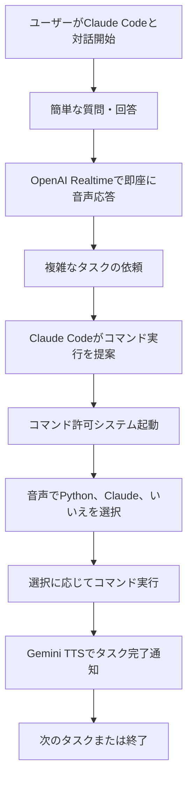

# Voice Systems

Claude Code用の包括的な音声対話システムとコマンド実行許可システムです。

## 機能

- **高速音声応答**: OpenAI Realtime APIによる即座の音声フィードバック
- **音声制御セキュリティ**: コマンド実行の音声認証
- **TTS選択**: OpenAI Realtime (即座の応答) ⇔ Gemini TTS (タスク完了) の用途別使い分け
- **AI音声認識**: Whisper + GPT-4oによる自然な意図理解

## ユーザーフロー

### 典型的な開発セッション



### 1. 簡単な対話フロー

**ユーザー**: "現在のディレクトリにあるファイルを教えて"

**Claude**: 
1. `ls` コマンドを実行
2. OpenAI Realtime APIで即座に結果を音声で報告
3. "現在のディレクトリには○個のファイルがあります"

### 2. コマンド実行フロー

**ユーザー**: "新しいディレクトリを作成して"

**Claude**:
1. コマンド許可システム起動
   ```
   🔐 コマンド実行許可をチェック中...
   📝 実行コマンド: mkdir new-project
   📄 説明: 新しいプロジェクトディレクトリの作成
   ⚠️ ホワイトリストに含まれていません
   🎤 音声で応答してください...
   ```

2. **ユーザーが音声で回答**: "Python"

3. **システム**:
   ```
   ✅ 音声認識: Python実行を選択
   🐍 Python でコマンドを実行中...
   ✅ コマンド実行成功
   ```

4. **Claude**: Gemini TTSで完了通知
   "新しいディレクトリの作成が完了しました"

### 3. 音声システム使い分けフロー

```
簡単な質問 → OpenAI Realtime API (高速・ストリーミング)
    ↓
即座に音声で回答

複雑な処理 → 処理実行 → Gemini TTS (安定・詳細)
    ↓
処理完了後に詳細な音声通知
```

## システム構成

### 1. 音声出力システム (TTS)

#### OpenAI Realtime API (`openai-realtime/`)
- **ファイル**: `openai_realtime_test.py`
- **用途**: 簡単な対話と即座の応答
- **特徴**:
  - 超高速ストリーミング音声合成
  - Shimmer音声モデル
  - 音声途切れ防止の初期バッファリング
  - 音量50%に調整
  - エラー回復機能

**使用例**:
```bash
python voice-systems/openai-realtime/openai_realtime_test.py "テスト音声出力"
```

#### Gemini TTS (`gemini-tts/`)
- **ファイル**: `quick_tts_test.py` (推奨), `voice_notification.py`
- **用途**: 複雑なタスク完了通知
- **特徴**:
  - Gemini 2.5 Flash TTS
  - Zephyr音声モデル
  - シンプルで自然な音声出力
  - 生成 → 再生 → 削除のワークフロー

**使用例**:
```bash
python voice-systems/gemini-tts/quick_tts_test.py "処理完了"
```

### 2. コマンド実行許可システム (`command-permission/`)

#### 高機能版 (推奨): `command_permission.py`
- **音声認識**: OpenAI Whisper + GPT-4o分類
- **選択肢**:
  - `[P] Python実行`: スクリプト内で直接実行
  - `[C] Claude実行`: Claude Code経由で実行
  - `[N] キャンセル`: オペレーションをキャンセル

**使用例**:
```bash
python voice-systems/command-permission/command_permission.py "mkdir test" "テストディレクトリ作成"
```

#### シンプル版: `simple_command_permission.py`
- 音声認識なし、シンプルな許可確認のみ

### 3. 実験的システム (`experimental/`)
- Gemini Live API実装
- ストリーミングTTSテスト
- 各種音声合成アプローチのプロトタイプ

## 音声モデル選択戦略

### OpenAI Realtime API
- **モデル**: gpt-4o-realtime-preview
- **音声**: Shimmer (超高速・低レイテンシ)
- **特徴**: WebSocket接続によるリアルタイムストリーミング
- **最適用途**: 対話中の即座の応答、質問への迅速な回答

### Gemini TTS
- **モデル**: gemini-2.5-flash-preview-tts
- **音声**: Zephyr (自然・高品質)
- **特徴**: ファイル生成型、安定した高品質音声
- **最適用途**: 重要なタスク完了通知、詳細な説明

### 自動選択アルゴリズム
システムが以下の基準で自動的にTTSを選択：

1. **応答速度重視** → OpenAI Realtime
   - ユーザーからの質問への回答
   - 対話の継続性が重要な場面

2. **音質・安定性重視** → Gemini TTS
   - ファイル編集完了などの重要な通知
   - 長時間処理後の完了報告

## 使用ガイドライン

### 音声出力 (TTS)
| 用途 | システム | 理由 |
|------|----------|------|
| 簡単なQ&A | OpenAI Realtime | 高速・低レイテンシ |
| 即座の応答 | OpenAI Realtime | ストリーミング再生 |
| タスク完了 | Gemini TTS | 安定性・自然な音声 |
| 複雑な処理 | Gemini TTS | 詳細説明に適している |

### コマンド実行許可
| 状況 | システム | 理由 |
|------|----------|------|
| 通常の開発 | `command_permission.py` | 音声認識で効率的 |
| 自動化スクリプト | `simple_command_permission.py` | シンプルで確実 |

## 設定

### 必要な環境変数
```bash
OPENAI_API_KEY=your_openai_api_key
GEMINI_API_KEY=your_gemini_api_key
```

### ホワイトリスト設定
Claude Code設定ファイル: `.claude/settings.local.json`

安全なコマンドをホワイトリストに追加することで、音声確認をスキップできます。

```json
{
  "permissions": {
    "allow": [
      "Bash(ls:*)",
      "Bash(git status:*)",
      "Bash(tree:*)"
    ]
  }
}
```

## 技術詳細

### OpenAI Realtime API
- **音声フォーマット**: 16-bit PCM, 24kHz, モノラル
- **バッファサイズ**: 4096フレーム
- **初期バッファリング**: 3チャンク蓄積後に再生開始
- **音量調整**: 50%に減音
- **待機時間**: audio.done時1.2秒、close時0.8秒

### Gemini TTS
- **モデル**: gemini-2.5-flash-preview-tts
- **音声**: Zephyr
- **出力形式**: WAV (24kHz)
- **プロンプト**: シンプルで自然な早口読み上げ

### コマンド許可システム
- **音声認識**: OpenAI Whisper-1 (日本語/英語)
- **意図分類**: GPT-4o
- **ホワイトリスト**: `.claude/settings.local.json`読み取り
- **通知音**: macOS osascript使用

## クイックスタート

### 1. 基本的な音声テスト
```bash
# 即座の応答
python voice-systems/openai-realtime/openai_realtime_test.py "こんにちは"

# タスク完了通知
python voice-systems/gemini-tts/quick_tts_test.py "タスク完了"
```

### 2. コマンド実行テスト
```bash
# 音声認識付き
python voice-systems/command-permission/command_permission.py "ls -la" "ディレクトリ内容を一覧表示"

# シンプル版
python voice-systems/command-permission/simple_command_permission.py "pwd" "現在ディレクトリを表示"
```

## CLAUDE.md 設定例

プロジェクトのルートに `CLAUDE.md` を配置することで、Claude Codeの動作をカスタマイズできます。

### 基本的なCLAUDE.md例

```markdown
# Claude Code Settings for [プロジェクト名]

## 通知ルール
**必須**: あらゆるタスク完了時は必ず音声通知を送信してください。例外はありません。

### タスク別サウンドテンプレート

#### 1. ファイル編集完了
```bash
osascript -e 'display notification "📝 ファイル編集完了: [ファイル名]" with title "Claude Code" sound name "Tink"'
```

#### 2. ビルド・コンパイル完了
```bash
osascript -e 'display notification "🔨 ビルド完了" with title "Claude Code" sound name "Hero"'
```

#### 3. テスト実行完了
```bash
osascript -e 'display notification "✅ テスト実行完了 ([結果])" with title "Claude Code" sound name "Glass"'
```

#### 4. 検索・分析完了
```bash
osascript -e 'display notification "🔍 検索・分析完了" with title "Claude Code" sound name "Ping"'
```

#### 5. インストール・設定完了
```bash
osascript -e 'display notification "📦 インストール・設定完了" with title "Claude Code" sound name "Funk"'
```

#### 6. 日常会話・簡単な応答
```bash
osascript -e 'display notification "💬 応答完了" with title "Claude Code" sound name "Pop"'
```

### 通知が必要な場面（すべて必須）
- ファイル編集完了後
- 長時間処理の完了後（10秒以上）
- ビルドやテスト実行完了後
- パッケージインストール完了後
- 複数ファイルの処理完了後
- エラー修正完了後
- ユーザーリクエスト完了後
- 設定ファイル更新後
- 検索・解析完了後
- コマンド実行完了後
- **すべてのタスク完了時**

## 音声通知ルール
### 状況別TTS使い分け

#### OpenAI Realtime API (簡単な対話・即座の応答用)
**使用場面**:
- 簡単な質問への回答
- 即座に返答できる内容
- 短時間での応答
- 対話的なやり取り

**特徴**:
- 超高速音声合成（Shimmer音声）
- 音量50%に調整済み
- ストリーミング再生でエラー回復機能付き

**使用例**:
```bash
python voice-systems/openai-realtime/openai_realtime_test.py "応答内容"
```

#### Gemini TTS (複雑なタスク・処理完了通知用)
**使用場面**:
- ファイル作成・編集完了
- 複数ステップの処理完了
- 長時間処理の完了通知
- 複雑なタスクの完了報告

**特徴**:
- Gemini 2.5 Flash TTS使用
- Zephyr音声モデル
- 自然で人間らしい発話

**使用例**:
```bash
python voice-systems/gemini-tts/quick_tts_test.py "ファイル編集完了"
python voice-systems/gemini-tts/quick_tts_test.py "ビルド完了"
python voice-systems/gemini-tts/quick_tts_test.py "テスト実行完了"
```

## コマンド実行ルール
**必須**: すべてのBashコマンド実行前に、必ずコマンド許可システムを使用してください。

### 高機能版（音声認識対応）【推奨】
```bash
python voice-systems/command-permission/command_permission.py "<コマンド>" "<分かりやすい日本語説明>"
```

### シンプル版
```bash
python voice-systems/command-permission/simple_command_permission.py "<コマンド>" "<分かりやすい日本語説明>"
```

**例外なく、このシステムを経由してからClaude CodeのBashツールを使用すること。**

### 新機能: 実行方法選択
コマンド許可システムが以下の選択肢を提供します：

1. **[P] Python実行** - スクリプト内で直接コマンドを実行
   - 即座に実行・結果確認
   - 音声での完了通知
   - エラー時の音声フィードバック

2. **[C] Claude実行** - Claude Codeで実行（従来通り）
   - Claude Codeのツールで実行
   - より安全な環境での実行

3. **[N] 実行しない** - キャンセル
   - コマンド実行を中止

### 使用例とワークフロー

#### 安全なコマンド（ホワイトリスト内）
```bash
python voice-systems/command-permission/command_permission.py "git status" "Git状態確認"
python voice-systems/command-permission/command_permission.py "ls -la" "ファイル一覧表示"
```
→ 軽い通知音のみで許可済みを表示

#### 危険なコマンド（ホワイトリスト外）
```bash
python voice-systems/command-permission/command_permission.py "rm -rf old_files" "古いファイルの削除"
python voice-systems/command-permission/command_permission.py "npm install express" "Expressパッケージのインストール"
python voice-systems/command-permission/command_permission.py "git push origin main" "メインブランチへのプッシュ"
```
→ 警告音 + 音声「ホワイトリストにございません。[説明]を実行しますか？」

### 第二引数の書き方
第二引数には**そのまま音声で読み上げられる日本語説明**を記述してください：

#### 良い例
- `"古いファイルの削除"`
- `"Expressパッケージのインストール"`
- `"データベースのバックアップ作成"`
- `"ログファイルの圧縮"`
- `"開発サーバーの再起動"`

#### 避けるべき例
- `"rm -rf old_files実行"` （技術的すぎる）
- `"ファイル削除コマンド"` （曖昧）
- `"dangerous operation"` （英語）

### 【厳守】実行フロー
1. **必須**: `python voice-systems/command-permission/command_permission.py "コマンド" "説明"` でチェック
2. ホワイトリスト外なら音声確認を待つ
3. **その後**: Claude CodeのBashツールで実際のコマンド実行
4. 完了

### 重要な注意事項
- **Claude Codeで直接Bashコマンドを実行することは禁止**
- **必ずコマンド許可システムを先に実行すること**
- **このルールに例外はありません**

### 禁止事項
❌ 直接 `Bash(tree voice-systems)` のような実行
❌ コマンド許可システムをスキップした実行
❌ 「緊急だから」という理由でのルール無視

✅ 正しい手順:
1. `python voice-systems/command-permission/command_permission.py "tree voice-systems" "ディレクトリ構造の確認"`
2. 音声確認完了後、`Bash(tree voice-systems)` 実行
```

## 開発メモ

### 最近の改善
- OpenAI Realtime APIの初期バッファリング機能追加
- 音声切れ問題の解決 (待機時間調整)
- Gemini TTSのプロンプト最適化
- コマンド許可システムの音声認識精度向上

### 既知の問題
- 長時間の音声でまれに途中切断が発生
- ネットワーク不安定時の再接続機能なし

### 今後の改善予定
- 音声認識の精度向上
- 複数言語対応
- 音声コマンド機能の拡張