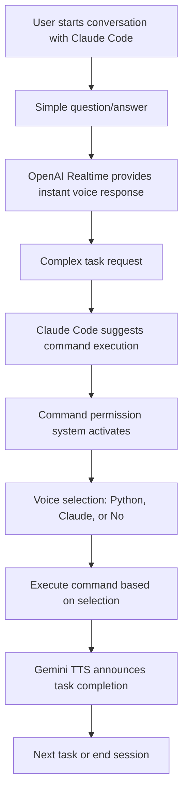

# 🎤 Voice Systems - Revolutionary AI Voice Integration

**Transform your Claude Code experience with intelligent voice interaction and security**

A comprehensive voice interaction system and command execution permission system for Claude Code that brings natural conversation and voice-controlled security to your development workflow.

## ✨ Revolutionary Features

🚀 **Ultra-fast voice responses**: Experience lightning-fast audio feedback with OpenAI Realtime API - no more waiting for text responses!

🔒 **Voice-controlled security**: Revolutionary voice authorization system that speaks to you and listens to your commands for safe execution

🎯 **Intelligent TTS selection**: Seamlessly switches between OpenAI Realtime (instant responses) ⇔ Gemini TTS (task completion) based on context

🧠 **Advanced AI voice recognition**: Natural intent understanding powered by Whisper + GPT-4o - just speak naturally!

## User Flow

### Typical Development Session



### 1. Simple Interaction Flow

**User**: "Tell me about the files in the current directory"

**Claude**: 
1. Executes `ls` command
2. OpenAI Realtime API provides immediate voice report
3. "The current directory contains X files..."

### 2. Command Execution Flow

**User**: "Create a new directory"

**Claude**:
1. Launches command permission system
   ```
   🔐 Checking command execution permission...
   📝 Command: mkdir new-project
   📄 Description: Create new project directory
   ⚠️ Not in whitelist
   🎤 Please respond with voice...
   ```

2. **User responds with voice**: "Python"

3. **System**:
   ```
   ✅ Voice recognition: Python execution selected
   🐍 Executing command with Python...
   ✅ Command execution successful
   ```

4. **Claude**: Gemini TTS completion notification
   "New directory creation completed"

### 3. Voice System Selection Flow

```
Simple questions → OpenAI Realtime API (fast, streaming)
    ↓
Immediate voice response

Complex processing → Execute → Gemini TTS (stable, detailed)
    ↓
Detailed voice notification after completion
```

## System Architecture

### 1. Voice Output Systems (TTS)

#### OpenAI Realtime API (`openai-realtime/`)
- **File**: `openai_realtime_test.py`
- **Purpose**: Simple interaction and immediate responses
- **Features**:
  - Ultra-fast streaming voice synthesis
  - Shimmer voice model
  - Initial buffering to prevent audio chopiness
  - Volume adjusted to 50%
  - Error recovery functionality

**Usage**:
```bash
python voice-systems/openai-realtime/openai_realtime_test.py "Test voice output"
```

#### Gemini TTS (`gemini-tts/`)
- **Files**: `quick_tts_test.py` (recommended), `voice_notification.py`
- **Purpose**: Complex task completion notifications
- **Features**:
  - Gemini 2.5 Flash TTS
  - Zephyr voice model
  - Simple and natural voice output
  - Generate → Play → Delete workflow

**Usage**:
```bash
python voice-systems/gemini-tts/quick_tts_test.py "Processing completed"
```

### 2. Command Execution Permission System (`command-permission/`)

#### Full-featured version (recommended): `command_permission.py`
- **Voice recognition**: OpenAI Whisper + GPT-4o classification
- **Options**:
  - `[P] Python execution`: Direct execution within script
  - `[C] Claude execution`: Execute via Claude Code
  - `[N] Cancel`: Cancel operation

**Usage**:
```bash
python voice-systems/command-permission/command_permission.py "mkdir test" "Create test directory"
```

#### Simple version: `simple_command_permission.py`
- No voice recognition, simple permission confirmation only

### 3. Experimental Systems (`experimental/`)
- Gemini Live API implementation
- Streaming TTS tests
- Various voice synthesis approach prototypes

## Voice Model Selection Strategy

### OpenAI Realtime API
- **Model**: gpt-4o-realtime-preview
- **Voice**: Shimmer (ultra-fast, low-latency)
- **Features**: Real-time streaming via WebSocket connection
- **Optimal Use**: Instant responses during conversation, quick answers to questions

### Gemini TTS
- **Model**: gemini-2.5-flash-preview-tts
- **Voice**: Zephyr (natural, high-quality)
- **Features**: File generation type, stable high-quality audio
- **Optimal Use**: Important task completion notifications, detailed explanations

### Automatic Selection Algorithm
The system automatically selects TTS based on the following criteria:

1. **Speed Priority** → OpenAI Realtime
   - Responses to user questions
   - Situations where conversation continuity is important

2. **Quality & Stability Priority** → Gemini TTS
   - Important notifications like file editing completion
   - Completion reports after long-running processes

## Usage Guidelines

### Voice Output (TTS)
| Use Case | System | Reason |
|----------|--------|--------|
| Simple Q&A | OpenAI Realtime | Fast, low latency |
| Immediate responses | OpenAI Realtime | Streaming playback |
| Task completion | Gemini TTS | Stability, natural voice |
| Complex processing | Gemini TTS | Suitable for detailed explanations |

### Command Execution Permission
| Situation | System | Reason |
|-----------|--------|--------|
| Regular development | `command_permission.py` | Efficient with voice recognition |
| Automation scripts | `simple_command_permission.py` | Simple and reliable |

## Configuration

### Required Environment Variables
```bash
OPENAI_API_KEY=your_openai_api_key
GEMINI_API_KEY=your_gemini_api_key
```

### Whitelist Settings
Claude Code configuration file: `.claude/settings.local.json`

Add safe commands to the whitelist to skip voice confirmation.

```json
{
  "permissions": {
    "allow": [
      "Bash(ls:*)",
      "Bash(git status:*)",
      "Bash(tree:*)"
    ]
  }
}
```

## Technical Details

### OpenAI Realtime API
- **Audio format**: 16-bit PCM, 24kHz, Mono
- **Buffer size**: 4096 frames
- **Initial buffering**: Start playback after accumulating 3 chunks
- **Volume adjustment**: Reduced to 50%
- **Wait times**: 1.2s for audio.done, 0.8s for close

### Gemini TTS
- **Model**: gemini-2.5-flash-preview-tts
- **Voice**: Zephyr
- **Output format**: WAV (24kHz)
- **Prompt**: Simple and natural fast-paced reading

### Command Permission System
- **Voice recognition**: OpenAI Whisper-1 (Japanese/English)
- **Intent classification**: GPT-4o
- **Whitelist**: Read from `.claude/settings.local.json`
- **Notification sounds**: Using macOS osascript

## Quick Start

### 1. Basic Voice Tests
```bash
# Immediate responses
python voice-systems/openai-realtime/openai_realtime_test.py "Hello"

# Task completion notifications
python voice-systems/gemini-tts/quick_tts_test.py "Task completed"
```

### 2. Command Execution Tests
```bash
# With voice recognition
python voice-systems/command-permission/command_permission.py "ls -la" "List directory contents"

# Simple version
python voice-systems/command-permission/simple_command_permission.py "pwd" "Show current directory"
```

## CLAUDE.md Configuration Examples

Place `CLAUDE.md` at the project root to customize Claude Code behavior.

### Basic CLAUDE.md Example

```markdown
# Claude Code Settings for [Project Name]

## Notification Rules
**Required**: Voice notifications must be sent for all task completions without exception.

### Task-Specific Sound Templates

#### 1. File Edit Complete
osascript -e 'display notification "📝 File edited: [filename]" with title "Claude Code" sound name "Tink"'

#### 2. Build Complete
osascript -e 'display notification "🔨 Build complete" with title "Claude Code" sound name "Hero"'

#### 3. Test Complete
osascript -e 'display notification "✅ Tests completed ([result])" with title "Claude Code" sound name "Glass"'

#### 4. Search/Analysis Complete
osascript -e 'display notification "🔍 Search/Analysis complete" with title "Claude Code" sound name "Ping"'

#### 5. Installation/Setup Complete
osascript -e 'display notification "📦 Installation/Setup complete" with title "Claude Code" sound name "Funk"'

#### 6. Daily Conversation/Simple Response
osascript -e 'display notification "💬 Response complete" with title "Claude Code" sound name "Pop"'

### Scenarios Requiring Notifications (All Mandatory)
- After file editing completion
- After long-running processes completion (10+ seconds)
- After build or test execution completion
- After package installation completion
- After multiple file processing completion
- After error fixing completion
- After user request completion
- After configuration file updates
- After search/analysis completion
- After command execution completion
- **After ALL task completions**

## Voice Notification Rules
### Situation-Based TTS Usage

#### OpenAI Realtime API (Simple Interaction & Immediate Response)
**Usage Scenarios**:
- Simple question responses
- Content that can be answered immediately
- Short-duration responses
- Interactive exchanges

**Features**:
- Ultra-fast voice synthesis (Shimmer voice)
- Volume adjusted to 50%
- Streaming playback with error recovery functionality

**Usage Examples**:
python voice-systems/openai-realtime/openai_realtime_test.py "Response content"

#### Gemini TTS (Complex Tasks & Process Completion Notifications)
**Usage Scenarios**:
- File creation/editing completion
- Multi-step process completion
- Long-running process completion notifications
- Complex task completion reports

**Features**:
- Uses Gemini 2.5 Flash TTS
- Zephyr voice model
- Natural, human-like speech

**Usage Examples**:
python voice-systems/gemini-tts/quick_tts_test.py "File editing complete"
python voice-systems/gemini-tts/quick_tts_test.py "Build complete"
python voice-systems/gemini-tts/quick_tts_test.py "Test execution complete"

## Command Execution Rules
**Required**: Command permission system must be used before all Bash command execution.

### Full-Featured Version (Voice Recognition) [Recommended]
python voice-systems/command-permission/command_permission.py "<command>" "<clear Japanese description>"

### Simple Version
python voice-systems/command-permission/simple_command_permission.py "<command>" "<clear Japanese description>"

**Without exception, use this system before using Claude Code's Bash tools.**

### New Feature: Execution Method Selection
The command permission system provides the following options:

1. **[P] Python Execution** - Direct execution within script
   - Immediate execution and result confirmation
   - Voice completion notifications
   - Voice feedback on errors

2. **[C] Claude Execution** - Execute via Claude Code (traditional method)
   - Execute through Claude Code tools
   - Safer execution environment

3. **[N] Do Not Execute** - Cancel
   - Cancel command execution

### Usage Examples and Workflow

#### Safe Commands (In Whitelist)
python voice-systems/command-permission/command_permission.py "git status" "Check Git status"
python voice-systems/command-permission/command_permission.py "ls -la" "List directory contents"
→ Light notification sound only, showing approved status

#### Dangerous Commands (Not in Whitelist)
python voice-systems/command-permission/command_permission.py "rm -rf old_files" "Delete old files"
python voice-systems/command-permission/command_permission.py "npm install express" "Install Express package"
python voice-systems/command-permission/command_permission.py "git push origin main" "Push to main branch"
→ Warning sound + voice "Not in whitelist. Execute [description]?"

### Second Argument Guidelines
The second argument should contain **Japanese description that will be read aloud as-is**:

#### Good Examples
- "Delete old files"
- "Install Express package"
- "Create database backup"
- "Compress log files"
- "Restart development server"

#### Examples to Avoid
- "Execute rm -rf old_files" (Too technical)
- "File deletion command" (Vague)
- "dangerous operation" (English)

### [Strict Adherence] Execution Flow
1. **Required**: python voice-systems/command-permission/command_permission.py "command" "description" check
2. Wait for voice confirmation if not in whitelist
3. **Then**: Execute actual command with Claude Code Bash tools
4. Complete

### Important Notes
- **Direct Bash command execution in Claude Code is prohibited**
- **Command permission system must be executed first**
- **There are no exceptions to this rule**

### Prohibited Actions
❌ Direct execution like Bash(tree voice-systems)
❌ Skipping command permission system
❌ Ignoring rules for "emergency" reasons

✅ Correct procedure:
1. python voice-systems/command-permission/command_permission.py "tree voice-systems" "Check directory structure"
2. After voice confirmation completion, execute Bash(tree voice-systems)
```

## Development Notes

### Recent Improvements
- Added initial buffering functionality to OpenAI Realtime API
- Fixed audio cutting issues (timing adjustments)
- Optimized Gemini TTS prompts
- Improved voice recognition accuracy in command permission system

### Known Issues
- Rare mid-audio disconnection during long voice outputs
- No reconnection functionality during network instability

### Future Improvements
- Enhanced voice recognition accuracy
- Multi-language support
- Extended voice command functionality